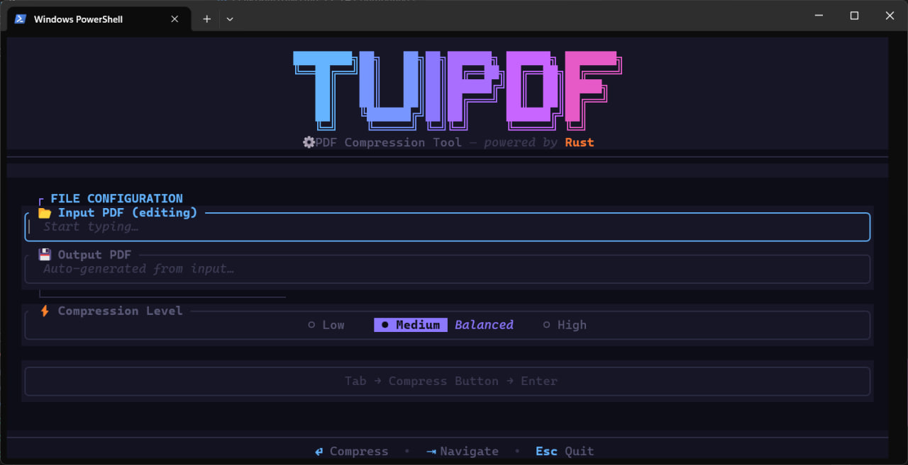

<div align="center">

# TUIPDF

**A beautifully crafted, terminal-native PDF compressor — built in pure Rust.**

<br/>

[](https://www.rust-lang.org/)
[](LICENSE)
[](CONTRIBUTING.md)

<br/>

[Features](#-key-features) · [Installation](#-installation) · [Usage](#-usage) · [Architecture](#%EF%B8%8F-architecture-how-it-works) · [Tech Stack](#%EF%B8%8F-technology-stack) · [Roadmap](#%EF%B8%8F-roadmap) · [Contributing](#-contributing) · [License](#-license)

</div>

<br/>

<div align="center">
  
</div>

<br/>

---

## ⚡ Overview

**tuipdf** brings production-grade PDF optimization directly into your terminal. It delivers a rich, keyboard-driven TUI experience with **zero external C dependencies** and **zero third-party tool licenses** to worry about.

> **No uploads. No cloud. No tracking.** Your files never leave your machine.

Built for developers, power users, and open-source contributors who believe productivity tools should be **fast**, **local**, and **beautiful**.

### Intelligent Compression Engine

The pipeline is implemented in **pure Rust** with a color-space-aware, per-object compression strategy:

| Input Type | Strategy |
| :--- | :--- |
| **JPEG images** | Decoded, optionally DPI downsampled, and re-encoded at target quality. |
| **FlateDecode (PNG-style)** | Decompressed, color-space-aware pixel reconstruction, converted to JPEG. |
| **Grayscale / 1-bit B&W** | Preserved as grayscale JPEG — eliminates unnecessary channel bloat. |
| **CMYK images** | Converted to RGB via standard subtractive model before encoding. |
| **Indexed / Separation / DeviceN** | Safely skipped to prevent discoloration. |
| **Content streams, fonts, vectors** | Kept intact — never recompressed. |

---

## ✨ Key Features

| | Feature | Description |
| :--- | :--- | :--- |
| 📦 | **Smart Compression** | Deep, per-object PDF analysis — images are aggressively compressed while vectors and text remain crystal clear. |
| 🎚️ | **Tailored Profiles** | Three optimized tiers: **Low** (85% quality), **Medium** (75%), and **High** (50% + metadata stripping). |
| 🎨 | **Color Fidelity** | Full detection of DeviceRGB, DeviceGray, DeviceCMYK, and ICCBased color spaces prevents discoloration. |
| 📄 | **Scanned PDF Support** | Handles B&W, grayscale, and color documents at 1-bit, 2-bit, 4-bit, and 8-bit depths. |
| 🖥️ | **Beautiful TUI** | A slick, distraction-free terminal interface with smooth animations and real-time processing stats. |
| 🔒 | **Privacy First** | 100% local, offline processing. Zero data collection. |
| ⚡ | **Blazing Fast** | Pure Rust with `rayon` for data-parallel processing and automatic memory-pressure detection. |
| 🔧 | **Zero C Dependencies** | No system libraries, no CMake, no MuPDF — everything builds from source via `cargo`. |

---

## 📦 Installation

> For full prerequisites, platform-specific instructions, troubleshooting, and manual compilation steps, see the **[Installation Guide](INSTALL.md)**.

### Quick Start

**Cargo (crates.io):**
```bash
cargo install tuipdf
```

**Windows (PowerShell):**
```powershell
irm https://raw.githubusercontent.com/KnightShadows/tuipdf/main/install_windows.ps1 | iex
```

**Linux (Debian / Ubuntu):**
```bash
git clone https://github.com/KnightShadows/tuipdf.git && cd tuipdf
./install.sh
```

**macOS:**
```bash
git clone https://github.com/KnightShadows/tuipdf.git && cd tuipdf
./install_mac.sh
```

**From Source (any platform):**
```bash
git clone https://github.com/KnightShadows/tuipdf.git && cd tuipdf
cargo install --path .
```

---

## 🚀 Usage

Launch the interactive terminal interface:

```bash
tuipdf
```

Open a PDF directly:

```bash
tuipdf path/to/document.pdf
```

### ⌨️ Keyboard Shortcuts

| Shortcut | Action |
| :--- | :--- |
| `Enter` | Cycle compression levels / Start compression |
| `Tab` | Switch UI focus |
| `q` / `Esc` | Gracefully quit |
| `Ctrl+C` | Force quit |

---

## ⚙️ Architecture: How It Works

```text
┌──────────┐     ┌───────────┐     ┌──────────────┐     ┌───────────┐     ┌──────────┐
│  Load &  │────▶│ Classify  │────▶│  Extract &   │────▶│ Rebuild & │────▶│  Write   │
│  Parse   │     │  Objects  │     │  Compress    │     │ Reinsert  │     │  Output  │
└──────────┘     └───────────┘     └──────────────┘     └───────────┘     └──────────┘
      │                │                    │                   │               │
   lopdf          Color space          image crate          Update          Export
   parser         detection            JPEG encoding       dictionaries     final PDF
```

1. **Parse** — `lopdf` loads and validates the PDF structure.
2. **Classify** — Each stream object is tagged: JPEG, PNG/Flate, RawBitmap, Font, FormXObject, or Content Stream.
3. **Color Detect** — The `ColorSpace` dictionary entry is fully resolved (DeviceRGB, DeviceCMYK, ICCBased N=?, Indexed → skip).
4. **Extract** — Streams are decompressed to raw pixel bytes.
5. **Compress** — Images are re-encoded as JPEG at target quality; content streams and fonts are untouched.
6. **Rebuild** — Compressed data is reinserted with updated dictionary entries (Filter, Width, Height, ColorSpace, BitsPerComponent).
7. **Write** — The document is saved with standard cross-reference tables.

---

## 🆚 Why tuipdf?

| | tuipdf | Online Compressors |
| :--- | :---: | :---: |
| **🔒 Privacy** | ✅ Files stay strictly local | ❌ Uploaded to remote servers |
| **⚡ Speed** | ✅ Instant, native execution | ❌ Bottlenecked by connection |
| **🌐 Offline** | ✅ Always works | ❌ Requires internet |
| **💸 Cost** | ✅ Free, forever | ❌ Often paywalled or limited |
| **🖥️ Workflow** | ✅ Stays in your terminal | ❌ Context-switch to browser |
| **📄 Scanned PDFs** | ✅ Full multi-depth support | ⚠️ Often rejected |
| **🎨 Color Fidelity** | ✅ CMYK / ICC aware | ⚠️ Prone to color shifting |

---

## 🛠️ Technology Stack

| Component | Role |
| :--- | :--- |
| [**ratatui**](https://github.com/ratatui-org/ratatui) | Rich, responsive TUI framework |
| [**crossterm**](https://github.com/crossterm-rs/crossterm) | Cross-platform terminal backend |
| [**lopdf**](https://github.com/J-F-Liu/lopdf) | Low-level PDF parsing and manipulation |
| [**image**](https://github.com/image-rs/image) | High-performance image decoding and encoding |
| [**flate2**](https://github.com/rust-lang/flate2-rs) | Fast Zlib compression for FlateDecode streams |
| [**rayon**](https://github.com/rayon-rs/rayon) | Fearless data-parallel concurrency |

---

## 🗺️ Roadmap

### Phase 1: Core Compressor — ✅ Complete

- [x] Pure-Rust compression pipeline with full color-space awareness
- [x] Scanned PDF support and intelligent memory-pressure detection
- [x] Premium TUI with dynamic gradients and active animations
- [x] Robust cross-platform build (Windows, Linux, macOS)
- [x] Tailored compression tiers (Low, Medium, High)
- [x] Comprehensive integration test suite

### Phase 2: Conversions & Operations — *In Progress*

- [ ] PDF to Image / Image to PDF
- [ ] PDF to Word / Word to PDF
- [ ] Merge and Split operations
- [ ] Page Extraction and Removal

### Phase 3: Security & Advanced UX

- [ ] Add / Remove PDF Passwords
- [ ] Batch Processing Mode
- [ ] Integrated terminal-native file picker

---

## 🤝 Contributing

Open source is built on collaboration. Whether it's a bug report, a new feature, or a documentation improvement — your contributions are highly valued.

Please review the **[Contribution Guidelines](CONTRIBUTING.md)** before getting started.

---

## 📄 License

Copyright © 2026 **KnightShadows Organization** & **Aditya Anand**

This project is licensed under the **[Mozilla Public License 2.0 (MPL 2.0)](LICENSE)**.

---

<div align="center">
<br/>

**Made with 🦀 by [Aditya Anand](https://github.com/adityaanand05) under [KnightShadows](https://github.com/KnightShadows)**

*Fast. Local. Open. — tuipdf*

</div>
